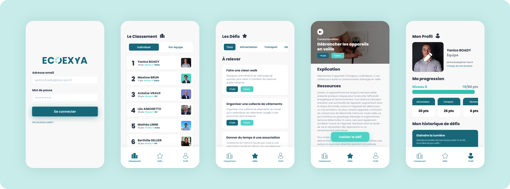

# The SMART Project

Students: **Yanice BOADY, Antoine VRAUX, Léo AIMONETTO, Mathéo LINNE, Maxime BRUN**

## Description 

During the first year of our Master in Computer Science at INSA Lyon, our team has embarked on an ambitious project in collaboration with Coexya, aiming to design an application that fosters employee engagement in Corporate Social Responsibility (CSR) challenges. It was a tough challenge, having to create a whole app, form design to deployment.
To understand better what we did, you can look at the mockup here :
https://www.figma.com/proto/j4R51Td64BZLwUGOxrG22b/Wireframe?type=design&node-id=165-971&t=Wv2S3ZSnfZGExtDc-0&scaling=scale-down&page-id=24%3A191

## Project Goal
This project aimed to develop an application for Coexya, with the following objectives:

- **Employee Engagement Through RSE Challenges:** Create an engaging platform where employees can participate in Corporate Social Responsibility (CSR) challenges and games outside of their working hours.

- **Functional and Deployable Solution:** Ensure the application is fully functional and ready for deployment within Coexya's infrastructure, focusing on reliability and scalability.

- **User-Friendly Design:** Design the application with a strong emphasis on ergonomics, making it easy and pleasant for employees to use regularly.

- **Advanced Gamification Features:** Incorporate advanced gamification elements to enhance user engagement and motivation by transforming CSR activities into a rewarding and fun experience.

- **Ongoing Development and Evolution:** Plan for the application's continuous improvement by adding new features and functionalities over time, based on user feedback and evolving company needs.

- **Integration of AI for Challenge Generation:** Explore the potential integration of Artificial Intelligence (AI) to generate new and unique CSR challenges, personalizing the experience for each user and encouraging ongoing participation.

- **Community Building:** Foster a sense of community among employees by encouraging collaboration and competition through leaderboards, team challenges, and social sharing capabilities.

- **Impact Tracking and Reporting:** Include features for tracking and reporting the collective impact of the CSR activities completed by employees, providing valuable insights into the company's social and environmental contributions.

These objectives outline our plan for creating a dynamic and impactful application that not only **engages Coexya's employees in meaningful CSR activities but also aligns with the company's values and commitment to social responsibility.**
## Requirements

To meet the outlined project goals, specific requirements need to be addressed in the development of the application:

- **Ease of Use and Accessibility:** The application must feature an intuitive user interface (UI) that allows for quick onboarding of employees, ensuring they can easily navigate and engage with the CSR challenges from the outset. Accessibility standards (such as WCAG) must be adhered to, guaranteeing the application is accessible to all employees, including those with disabilities. This requirement extends to ensuring the application is compatible across various devices and platforms, offering flexibility in how and where employees choose to engage.

- **Maintainability and Code Reusability:** The application's codebase must be structured and documented in a manner that allows for easy handover and subsequent development by Coexya's internal teams. This includes adopting coding standards, utilizing well-structured version control practices, and incorporating detailed documentation. The choice of technologies should align with those familiar to Coexya's development team or be common enough to ensure ease of future maintenance and updates.

- **Comprehensive Admin Features Without Database Access:** It's crucial to develop a robust administrative interface that enables non-technical staff to manage the application effectively without direct database access. This includes functionalities such as user management, CSR challenge creation and moderation, analytics and reporting tools, and the ability to update application settings and content dynamically. The admin interface should be secure, user-friendly, and provide granular control over the application's features and content, enabling Coexya to adapt and evolve the platform according to feedback and changing requirements.

These requirements are designed to ensure the application is not only a valuable tool for engaging Coexya's employees in CSR activities but also a sustainable and adaptable solution that can grow and evolve with the company's needs.
## Conlusion

We learned a lot ! And we are proud to say that the app is now fully available for the Coexya employees.
